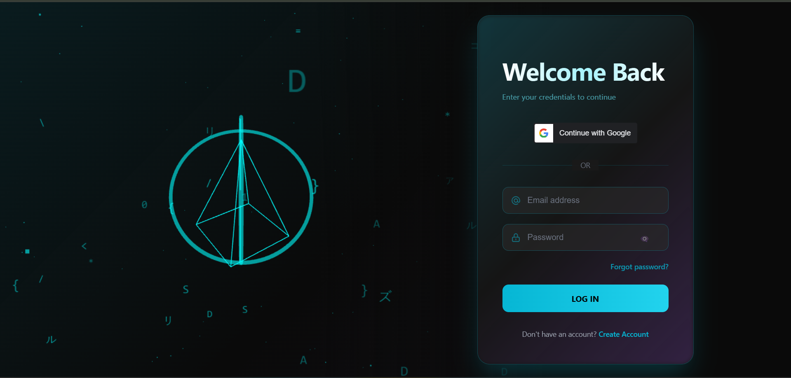
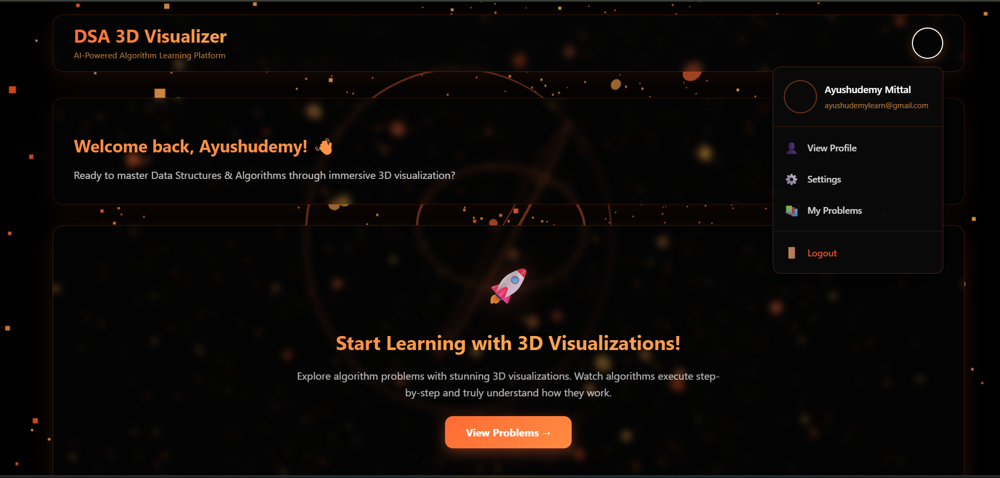
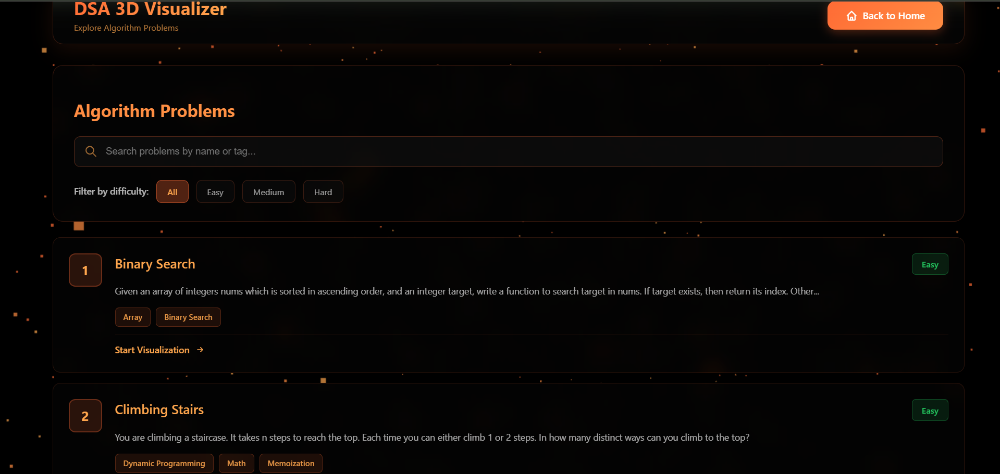
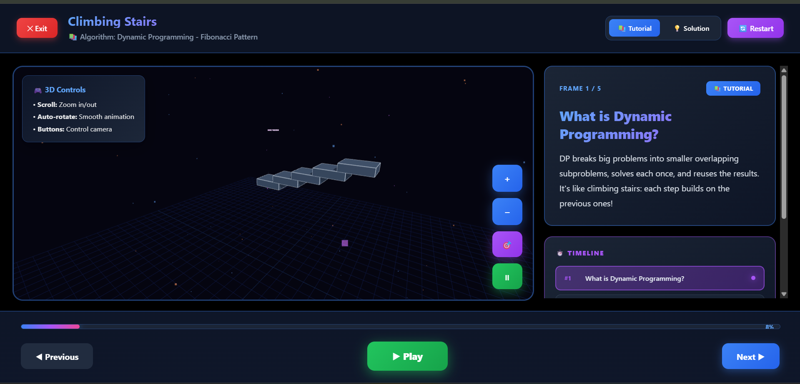

# 🎮 DSA 3D Visualizer

> **Transform Data Structures & Algorithms from abstract concepts into interactive 3D experiences**

An immersive learning platform that brings DSA concepts to life with stunning 3D visualizations, step-by-step tutorials, and interactive problem-solving.

[](https://choosealicense.com/licenses/mit/)
[](https://reactjs.org/)
[](https://www.typescriptlang.org/)
[](https://threejs.org/)
[](https://www.mongodb.com/)
[](https://nodejs.org/)

---

## 📸 Screenshots

<div align="center">
  
  <p><i>Creative Authorization Page with Google Login</i></p>
  
  
  <p><i>Beautiful landing page with particle animations</i></p>
  
  
  <p><i>Browse problems with search and filters</i></p>
  
  
  <p><i>Interactive 3D visualizations with camera controls</i></p>
</div>

---

## ✨ Features

### 🎯 **Interactive 3D Visualizations**
- **Real-time 3D rendering** powered by Three.js
- **Interactive camera controls** - Zoom, rotate, and auto-rotate
- **Smooth animations** - Fly-in effects, pulse highlights, and transitions
- **Professional lighting** - Shadows, glow effects, and multi-point lighting
- **Multiple object types** - Arrays, Hash Maps, Trees, Pointers, and more

### 📚 **Comprehensive Learning Path**
- **10 curated DSA problems** from easy to hard
- **Dual-mode learning:**
  - 🎓 **Tutorial Mode** - Understand the algorithm step-by-step
  - 💡 **Solution Mode** - See the complete solution walkthrough
- **Frame-by-frame navigation** with play/pause controls
- **Code snippets** integrated with each step
- **Clear explanations** for every visualization frame

### 🔐 **User Authentication**
- Secure JWT-based authentication
- User registration and login
- Protected routes and API endpoints
- Password encryption with bcrypt

### 🎨 **Modern UI/UX**
- Clean, glassmorphism design
- Particle background effects
- Responsive layout
- Smooth transitions and animations
- Dark mode optimized

### 🔍 **Smart Problem Discovery**
- Real-time search functionality
- Filter by difficulty (Easy, Medium, Hard)
- Category tags
- Problem statistics

---

## 🚀 Quick Start

### Prerequisites

- **Node.js** (v20 or higher)
- **MongoDB** (local or Atlas)
- **npm** or **yarn**

### Installation

1. **Clone the repository**
   ```bash
   git clone https://github.com/Ayush-AI-ux/dsa-3d-visualizer.git
   cd dsa-3d-visualizer
   ```

2. **Install backend dependencies**
   ```bash
   cd backend
   npm install
   ```

3. **Install frontend dependencies**
   ```bash
   cd ../frontend
   npm install
   ```

4. **Set up environment variables**
   
   Create `.env` in the `backend` folder:
   ```env
   PORT=5000
   MONGODB_URI=mongodb://localhost:27017/dsa-visualizer
   JWT_SECRET=your_super_secret_jwt_key_here
   ```

5. **Start MongoDB**
   ```bash
   # If using local MongoDB
   mongod
   
   # Or use MongoDB Atlas connection string in .env
   ```

6. **Run the application**

   **Backend (Terminal 1):**
   ```bash
   cd backend
   npm start
   ```

   **Frontend (Terminal 2):**
   ```bash
   cd frontend
   npm run dev
   ```

7. **Open your browser**
   ```
   http://localhost:5173
   ```

---

## 🏗️ Tech Stack

### **Frontend**
| Technology | Purpose |
|------------|---------|
| ⚛️ **React 18** | UI framework with hooks and modern features |
| 📘 **TypeScript** | Type-safe development |
| 🎨 **Three.js** | 3D graphics and visualizations |
| 🧭 **React Router** | Client-side routing |
| ⚡ **Vite** | Lightning-fast build tool |

### **Backend**
| Technology | Purpose |
|------------|---------|
| 🟢 **Node.js** | JavaScript runtime |
| 🚂 **Express.js** | Web application framework |
| 🍃 **MongoDB** | NoSQL database |
| 🔐 **JWT** | Secure authentication |
| 🔒 **bcrypt** | Password hashing |

---

## 📁 Project Structure

```
dsa-3d-visualizer/
├── backend/
│   ├── models/
│   │   ├── User.js              # User schema
│   │   └── Problem.js           # Problem schema with 3D data
│   ├── routes/
│   │   ├── authRoutes.js        # Authentication endpoints
│   │   └── problemRoutes.js     # Problem CRUD endpoints
│   ├── middleware/
│   │   └── authMiddleware.js    # JWT verification
│   └── server.js                # Express server setup
│
├── frontend/
│   ├── src/
│   │   ├── components/
│   │   │   └── Scene3DRenderer.tsx    # 3D visualization engine
│   │   ├── pages/
│   │   │   ├── Login.tsx              # Login page
│   │   │   ├── Register.tsx           # Registration page
│   │   │   ├── Home.tsx               # Landing page
│   │   │   ├── ProblemsList.tsx       # Problems browser
│   │   │   ├── ProblemDetail.tsx      # Problem details
│   │   │   └── VisualizationPlayer.tsx # 3D visualization player
│   │   ├── services/
│   │   │   └── authService.ts         # Auth utilities
│   │   └── App.tsx                    # Main app component
│   └── package.json
│
└── README.md
```

---

## 🎮 How to Use

### 1️⃣ **Register/Login**
Create an account or log in to access the platform.

### 2️⃣ **Browse Problems**
- Search for specific problems
- Filter by difficulty
- View problem statistics

### 3️⃣ **Select a Problem**
Click on any problem to view:
- Detailed description
- Examples with explanations
- Constraints and hints

### 4️⃣ **Start Visualization**
Click "Start Visualization" to enter the interactive 3D learning mode:

#### **Tutorial Mode**
- Learn the algorithm concept
- See how the data structure works
- Understand the approach

#### **Solution Mode**
- Step-by-step code execution
- Visual representation of each step
- See values change in real-time

### 5️⃣ **Interactive Controls**
- 🔍**+ Zoom In** - Get closer to the visualization
- 🔍**- Zoom Out** - See the full picture
- 🎯 **Reset View** - Return to default camera position
- 🔄 **Auto-Rotate** - Automatic scene rotation
- ▶️ **Play/Pause** - Control animation playback
- ⏮️ **Previous/Next** - Navigate frames manually

---

## 📚 Available Problems

| # | Problem | Difficulty | Data Structures | Concepts |
|---|---------|------------|-----------------|----------|
| 1 | Two Sum | 🟢 Easy | Array, Hash Map | Hash Table, One-pass |
| 2 | Reverse Linked List | 🟢 Easy | Linked List | Pointers, Iteration |
| 3 | Valid Parentheses | 🟢 Easy | Stack | Stack, String |
| 4 | Maximum Subarray | 🟡 Medium | Array | Kadane's Algorithm, DP |
| 5 | Merge Two Sorted Lists | 🟢 Easy | Linked List | Two Pointers, Merge |
| 6 | Binary Search | 🟢 Easy | Array | Binary Search, Divide & Conquer |
| 7 | Climbing Stairs | 🟢 Easy | DP | Dynamic Programming, Fibonacci |
| 8 | Buy/Sell Stock | 🟢 Easy | Array | One-pass, Greedy |
| 9 | Valid Anagram | 🟢 Easy | Hash Map, String | Sorting, Frequency Count |
| 10 | Palindrome Number | 🟢 Easy | Math | Reverse Integer, Math |

---

## 🎨 3D Visualization Features

### **Object Types Supported**
- ✅ **Arrays** - 3D boxes with values and indices
- ✅ **Hash Maps** - Containers with key-value pairs
- ✅ **Pointers** - Animated arrows with labels
- ✅ **Target Displays** - Glowing spheres for goals
- ✅ **Connection Arcs** - Curved lines showing relationships
- ✅ **Result Boxes** - Highlighted solution displays
- ✅ **Text Labels** - 3D text always facing camera

### **Visual Effects**
- 🌟 **Glow Effects** - Highlighted elements pulse
- 💫 **Fly-in Animations** - Objects animate into view
- 🎭 **Shadows** - Real-time shadow rendering
- 💡 **Multi-point Lighting** - Professional 3-point lighting setup
- 🎨 **Color Coding** - Green for active, blue for inactive, gold for targets

### **Camera System**
- 🎥 **Smooth Damping** - Physics-based camera movements
- 🔄 **Auto-Rotate** - Cinematic scene rotation
- 📏 **Zoom Limits** - Prevent too close/far views
- 🎯 **Reset Function** - One-click return to optimal view

---

## 🛠️ Development

### **Running Tests**
```bash
# Backend tests
cd backend
npm test

# Frontend tests
cd frontend
npm test
```

### **Building for Production**
```bash
# Build frontend
cd frontend
npm run build

# Build output will be in frontend/dist
```

### **Linting**
```bash
# Frontend
cd frontend
npm run lint

# Backend
cd backend
npm run lint
```

---

## 🤝 Contributing

We welcome contributions! Here's how you can help:

### **Ways to Contribute**
1. 🐛 **Report Bugs** - Open an issue with details
2. 💡 **Suggest Features** - Share your ideas
3. 📝 **Improve Documentation** - Help others understand
4. 🎨 **Add Visualizations** - Create new problem visualizations
5. 🔧 **Fix Issues** - Submit pull requests

### **Contribution Steps**
1. Fork the repository
2. Create your feature branch (`git checkout -b feature/AmazingFeature`)
3. Commit your changes (`git commit -m 'Add some AmazingFeature'`)
4. Push to the branch (`git push origin feature/AmazingFeature`)
5. Open a Pull Request


## 🗺️ Roadmap

### **Version 1.0 (Current)** ✅
- [x] User authentication
- [x] 10 DSA problems
- [x] 3D visualization engine
- [x] Interactive camera controls
- [x] Tutorial and solution modes

### **Version 1.1** 🚧
- [ ] User progress tracking
- [ ] Problem bookmarking
- [ ] User dashboard
- [ ] 5 more problems

### **Version 2.0** 📋
- [ ] Tree visualizations
- [ ] Graph visualizations
- [ ] Practice mode
- [ ] Code editor integration
- [ ] 25+ total problems

### **Version 3.0** 🌟
- [ ] Mobile app (React Native)
- [ ] Discussion forums
- [ ] Leaderboards
- [ ] Premium features
- [ ] 50+ problems

---

## 📄 License

This project is licensed under the **MIT License** - see the [LICENSE](LICENSE) file for details.

---

## 🙏 Acknowledgments

- **Three.js** - Amazing 3D graphics library
- **React** - Powerful UI framework
- **MongoDB** - Flexible database
- **LeetCode** - Inspiration for problem selection
- **The DSA Community** - For feedback and support

---

## 📞 Contact & Support

- **GitHub Issues**: [Report bugs or request features](https://github.com/Ayush-AI-ux/dsa-3d-visualizer/issues)
- **Email**: ayushmittal8955@gmail.com
- **LinkedIn**: [Your Profile](https://www.linkedin.com/in/ayush-mittal-b25361289/)

---

<div align="center">

### 💙 **Made with passion for teaching DSA**

**If this project helped you learn DSA concepts, please consider giving it a ⭐**

[⬆ Back to Top](#-dsa-3d-visualizer)

</div>
